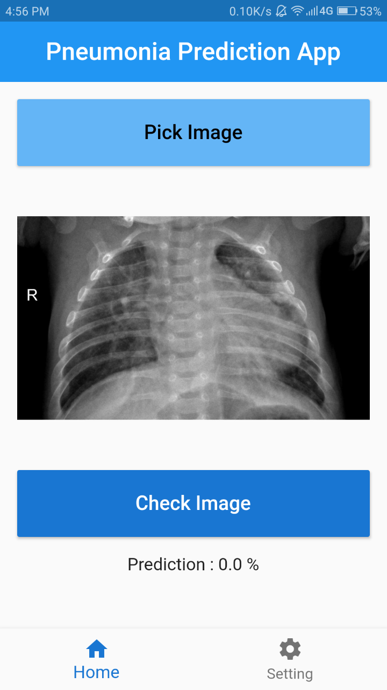

## About me

I am a student currently pursuing B.tech in Computer Science from Guru Gobind Singh Indraprastha University.I like to learn new things and try various things.This page is also my first attempt at Github pages ,so I tried to make a portfolio like website for a good experience as well as to showcase some of my projects.

## Experience

I don't have any experience of job since I am a student but I have done internship from All India Institute of Medical Sciences(AIIMS,Delhi) for 2 months where I learned Flask,HTML,Javascript,Jquery etc. and helped them in making an admin system for biometric system used there.I also had a little bit experience with raspberry pi which was used as the biometric machine.It was my first experience to see how people work in offices/organizations.Was a good experience.

## Projects I have worked on

### [Music Genre Classification](https://sumeshp99.github.io/music-genre-classification-with-cnn/)

It was my first deep learning project.Here I tried to train a neural network to classify genre of music using audio of music as input.Kind of fun as well as learned a little about audio processing.Learned spectrograms and other things.

### Pneumonia prediction

It was also a deep learning project.By this time it had been more than 5 months since i have used deep learning.So I made this to revisit some topics.Think of it as revision for myself.

### Pneumonia prediction application

This was an attempt to make a simple software with a UI to predict pneumonia.Model from previous application was used for prediction.UI was made using flutter(just a simple one) where user can select and upload images.It was a good project to learn dart as well as flutter.Backend was made using Flask.I have used Flask previously in my internship but it had been 1 year since then so I made this for revisit topics on flask.Works pretty ok.
